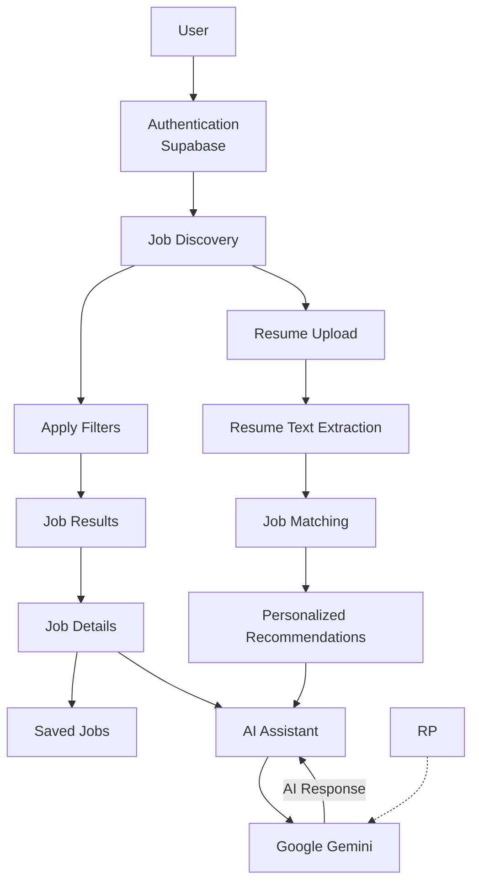
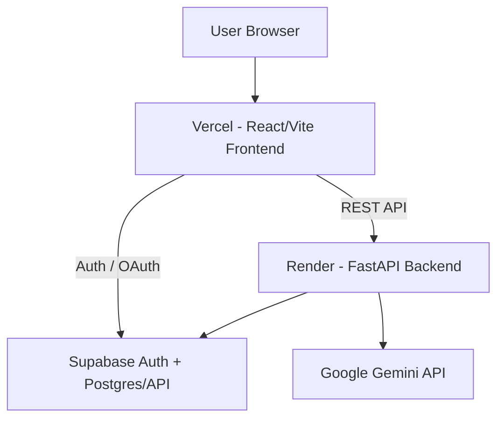

# JobWise AI

> AI-powered job discovery and matching that helps users find relevant opportunities, understand job fit, and make better application decisions.

JobWise AI brings job search, location-aware filtering, resume matching, saved jobs, and contextual AI assistance into one focused experience.

🌐 **[Live Website Link](https://job-wise-ai.vercel.app)** 

▶️ **[Project Video Link]** 

📚 **[API Documentation Link](https://jobwise-ai-backend.onrender.com/docs)**

---

## Product Preview

### Authentication

**Sign up**


**Login**


### Job discovery

**Main dashboard**


**Job listings, filters, resume matching, and AI assistant**


### Job details

**Job details, requirements, application links, and AI assistant**


These screenshots reflect the working UI tested locally before deployment.

---
## Product Workflow

---

## System Architecture



### Runtime responsibilities

- **Frontend:** UI, authentication UX, search/filter interactions, local caching, saved jobs, resume upload UI, AI assistant UI, and job-details rendering.
- **Backend:** job APIs, filtering/pagination, location data APIs, resume PDF extraction, recommendation logic, AI endpoints, and database access.
- **Supabase:** authentication plus the `jobs` data used by the backend.
- **Gemini:** resume analysis/enrichment and AI assistant requests.

---

## Technology Stack

| Layer | Technology |
|---|---|
| Frontend | React 19, Vite 8, React Icons |
| Backend | FastAPI, Uvicorn, Pydantic |
| Database & Auth | Supabase |
| PDF Processing | pypdf |
| AI | Google Gemini API, `google-genai` |
| Deployment | Vercel, Render |
| Source Control | GitHub |

---

## Authentication & Security

Authentication is handled by **Supabase Auth** with email/password, Google OAuth, password recovery, session persistence, and sign-out.

Frontend publishable credentials are supplied through Vite environment variables; server-side credentials stay in backend environment variables.

**Never commit real credentials or `.env` files.**

---

## Deployment

```text
GitHub
├──► Vercel ──► React/Vite Frontend
│
└──► Render ──► FastAPI Backend
                   ├──► Supabase
                   └──► Gemini (optional)
```

| Service | Production URL |
|---|---|
| Website | https://job-wise-ai.vercel.app |
| Backend | https://jobwise-ai-backend.onrender.com |
| API Docs | https://jobwise-ai-backend.onrender.com/docs |

---

## Local Development

### Prerequisites

- Node.js and npm
- Python 3.12+
- Supabase project
- Required environment variables

### Clone

```bash
git clone https://github.com/DarshanMathpal/JobWiseAI.git
cd JobWiseAI
```

### Frontend

```bash
cd frontend
cp .env.example .env
npm install
npm run dev
```

### Backend

```bash
cd backend
python3 -m venv venv
source venv/bin/activate
pip install -r requirements.txt
cp .env.example .env
uvicorn main:app --reload --host 0.0.0.0 --port 8000
```

Local frontend: `http://localhost:5173`  
Local API: `http://localhost:8000`

---

## Environment Variables

### Frontend — `frontend/.env`

```env
VITE_SUPABASE_URL=your_supabase_url
VITE_SUPABASE_PUBLISHABLE_KEY=your_supabase_publishable_key
VITE_API_BASE_URL=http://localhost:8000
```

### Backend — `backend/.env`

```env
SUPABASE_URL=your_supabase_url
SUPABASE_PUBLISHABLE_KEY=your_supabase_publishable_key
SUPABASE_SERVICE_ROLE_KEY=your_supabase_service_role_key
CORS_ORIGINS=http://localhost:5173
```

`GEMINI_API_KEY` is optional for the manual Gemini-powered enrichment/analysis workflows; users who enable Gemini-powered functionality should provide their own valid Gemini key.

**Never commit real credentials or `.env` files.**

---
