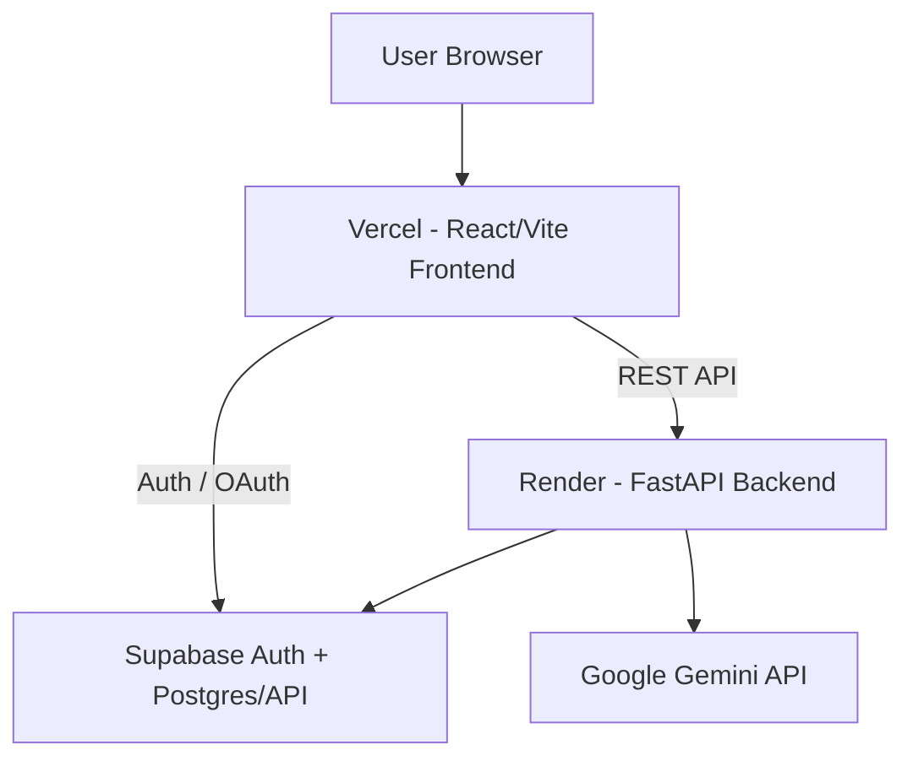

# JobWise AI

AI-powered job discovery and matching application that combines a React/Vite frontend with a FastAPI backend, Supabase data/authentication services, resume parsing, rule-based resume matching, and Gemini-powered AI assistance.

## Overview

JobWise AI helps users discover relevant jobs faster, refine results with structured filters, upload a PDF resume for personalized matching, ask an AI assistant about jobs, and save opportunities for later.

The application is split into two deployable parts:

- `frontend/` → React + Vite → Vercel
- `backend/` → FastAPI → Render

There is intentionally one project-level README: this file.

## Core Features

- Email/password authentication through Supabase
- Google OAuth through Supabase
- Password reset and recovery flow
- Fast cached initial job loading
- Cached country/filter data for smoother navigation
- Job search, sorting, pagination, and filtering
- Country → state → city location selection
- Country flags in the location selector
- Company-logo fallback avatars
- Saved jobs
- Job details and application links
- Structured job-description formatting
- PDF resume upload and text extraction
- Resume-derived profile creation
- Resume/job recommendations
- Gemini-powered AI assistant
- Responsive desktop and mobile layouts


## Screenshots

### Authentication

**Login**


**Sign up**


### Job discovery

**Main dashboard**


**Job listings, filters, resume matching, and AI assistant**


### Job details

**Job details, requirements, application links, and AI assistant**


These screenshots reflect the working UI tested locally before deployment.

## Product Workflow

```text
User
  │
  ▼
Authentication (Supabase)
  │
  ▼
Job Discovery
  │
  ├── Search / Role suggestions
  ├── Filters / Location / Experience / Domain
  └── Cached initial results
  │
  ▼
Job Results
  │
  ▼
Job Details
  │
  ├── Requirements
  ├── Application links
  └── AI Assistant
  │
  ├──────────────┐
  ▼              ▼
Resume Upload   Saved Jobs
  │
  ▼
Resume Profile + Matching
  │
  ▼
Personalized Recommendations
```

## System Architecture



### Runtime responsibilities

- **Frontend:** UI, authentication UX, search/filter interactions, local caching, saved jobs, resume upload UI, AI assistant UI, and job-details rendering.
- **Backend:** job APIs, filtering/pagination, location data APIs, resume PDF extraction, recommendation logic, AI endpoints, and database access.
- **Supabase:** authentication plus the `jobs` data used by the backend.
- **Gemini:** resume analysis/enrichment and AI assistant requests.

## Frontend Architecture

The frontend is a React single-page application built with Vite.

Important files:

```text
frontend/
├── index.html
├── package.json
├── package-lock.json
├── vite.config.js
├── .env.example
├── public/
│   └── favicon.svg
└── src/
    ├── App.jsx
    ├── App.css
    ├── JobAssistant.jsx
    ├── JobDetails.jsx
    ├── ResumeUpload.jsx
    ├── index.css
    ├── main.jsx
    ├── lib/
    │   ├── apiConfig.js
    │   └── supabaseClient.js
    └── assets/
        └── hero.png / generated assets as applicable
```

### Client-side caching

The frontend caches:

- the normal/default job result set
- countries used by the location selector
- filter options
- saved jobs

The default job cache is used to render a useful screen immediately; the frontend still requests fresh data in the background.

## Backend Architecture

The backend is a FastAPI application exposed from `backend/main.py`.

```text
backend/
├── main.py
├── supabase_client.py
├── supabase_admin.py
├── source_normalizer.py
├── ingest_jobs.py
├── enrich_jobs.py
├── enrich_one_job.py
├── inspect_data.py
├── analyze_dataset.py
├── check_duplicates.py
├── requirements.txt
└── .env.example
```

### Runtime API responsibilities

- health checks
- job search and pagination
- filter-option generation
- country/state/city lookup
- job details
- PDF resume extraction
- resume profile analysis endpoint
- Gemini resume analysis endpoint
- job recommendations
- AI assistant chat

The data-processing scripts support ingestion, source normalization, duplicate inspection, and AI enrichment workflows.

## Database Architecture

The application reads and writes the `jobs` table through Supabase.

The repository code uses fields including:

- `job_id`
- `title`
- `company_name`
- `location`
- `source`
- `description`
- `formatted_description`
- `skills`
- `roles`
- `min_experience`
- `max_experience`
- `domain`
- `employment_type`
- `apply_options`
- `thumbnail`
- AI enrichment fields such as `ai_skills`, `ai_roles`, `ai_tags`, and `ai_enriched`

The README intentionally does not invent additional tables or relationships that are not represented by the codebase.

## AI Architecture

### Resume workflow

1. The frontend uploads a PDF to `/api/resume/upload`.
2. FastAPI extracts text with `pypdf`.
3. The frontend derives a basic resume profile from the returned text.
4. The frontend requests `/api/jobs/recommend` for matching jobs.
5. Optional Gemini analysis is available through `/api/resume/analyze`.

### Job enrichment

The backend enrichment scripts use the Google Gemini SDK to enrich job records with skills, roles, experience, and tags.

### AI Assistant

The frontend sends the current question, profile, selected job context, recommended jobs, filtered jobs, and recent conversation history to `/api/assistant/chat`.

## Authentication

Authentication is handled by Supabase Auth.

Supported flows:

- email/password sign-up
- email/password login
- Google OAuth
- password reset email
- password recovery page
- remembered or session-only login persistence
- sign-out

Frontend Supabase credentials are read from Vite environment variables and are not hardcoded in source code.

## Caching Strategy

### Job cache

The frontend stores the default job result set in `localStorage` and uses it immediately on application load. A fresh API request can then replace the cached data.

### Country cache

Countries used by the location picker are stored in `localStorage`, avoiding a repeated country-list request across browser sessions.

### Filter cache

Filter options are cached in `localStorage` so source, skills, domains, and role suggestions can render faster.

### Saved jobs

Saved jobs are stored locally in the browser.

## API Documentation

### Health

`GET /api/health`

Returns the backend health status.

### Jobs

`GET /api/jobs`

Supports search, source, skills, locations, domains, experience, posted-window filtering, pagination, and sorting-related inputs.

### Job details

`GET /api/jobs/{job_id}`

Returns one job record.

### Filter options

`GET /api/jobs/filter-options`

Returns available source, skill, domain, and role-title options.

### Locations

`GET /api/locations/countries`

`GET /api/locations/{country_code}/states`

`GET /api/locations/{country_code}/states/{state_code}/cities`

Provide hierarchical location data for the location picker.

### Resume upload

`POST /api/resume/upload`

Accepts a PDF multipart upload and extracts readable text with `pypdf`.

### Resume profile

`POST /api/resume/profile`

Accepts resume text and returns a profile response.

### Resume AI analysis

`POST /api/resume/analyze`

Uses a supplied Gemini API key to analyze resume text.

### Job recommendations

`POST /api/jobs/recommend`

Returns jobs ranked against the supplied profile.

### AI assistant

`POST /api/assistant/chat`

Uses the supplied Gemini API key plus job/profile context to answer job-search questions.

## Environment Variables

### Frontend: `frontend/.env`

```env
VITE_SUPABASE_URL=your_supabase_url
VITE_SUPABASE_PUBLISHABLE_KEY=your_supabase_publishable_key
VITE_API_BASE_URL=http://localhost:8000
```

For production, `VITE_API_BASE_URL` should point to the deployed Render backend.

### Backend: `backend/.env`

```env
SUPABASE_URL=your_supabase_url
SUPABASE_PUBLISHABLE_KEY=your_supabase_publishable_key
SUPABASE_SERVICE_ROLE_KEY=your_supabase_service_role_key
CORS_ORIGINS=http://localhost:5173
```

`GEMINI_API_KEY` is used by the backend enrichment scripts (`enrich_jobs.py` and `enrich_one_job.py`) when those scripts are run manually.

Never commit real secrets.

## Local Development

### Prerequisites

- Node.js and npm
- Python 3.12+ recommended
- Supabase project
- Required environment variables

### 1. Clone the repository

```bash
git clone <your-github-repository-url>
cd ai-job-board
```

### 2. Configure frontend

```bash
cd frontend
cp .env.example .env
npm install
```

Set the real frontend values in `.env`.

### 3. Configure backend

```bash
cd ../backend
python3 -m venv venv
source venv/bin/activate
pip install -r requirements.txt
cp .env.example .env
```

Set the real backend values in `.env`.

### 4. Start backend

From `backend/`:

```bash
uvicorn main:app --reload --host 0.0.0.0 --port 8000
```

### 5. Start frontend

From `frontend/`:

```bash
npm run dev
```

The Vite development server normally runs on `http://localhost:5173`.

## Deployment

### GitHub

Push the final repository with this structure:

```text
README.md
frontend/
backend/
render.yaml
.gitignore
```

Do not commit `.env`, credentials, `node_modules`, Python virtual environments, or build output.

### Render — Backend

The repository includes `render.yaml` configured for the backend.

- Runtime: Python
- Root directory: `backend`
- Build command: `pip install -r requirements.txt`
- Start command: `uvicorn main:app --host 0.0.0.0 --port $PORT`
- Health check: `/api/health`

Set these Render environment variables:

- `SUPABASE_URL`
- `SUPABASE_PUBLISHABLE_KEY`
- `CORS_ORIGINS` with the deployed Vercel URL

If enrichment scripts are executed in an environment, also provide the appropriate Gemini and Supabase admin credentials there.

### Vercel — Frontend

Deploy the `frontend/` directory as the Vercel project root.

Build command:

```bash
npm run build
```

Output directory:

```text
dist
```

Set:

- `VITE_SUPABASE_URL`
- `VITE_SUPABASE_PUBLISHABLE_KEY`
- `VITE_API_BASE_URL`

`VITE_API_BASE_URL` should be the Render backend URL.

### Supabase Auth redirect configuration

After deployment, make sure Supabase Auth allows the production frontend URL and the Google OAuth redirect URL used by the application.

## Production Checklist

- [ ] Real secrets are stored only in deployment environment variables
- [ ] `VITE_API_BASE_URL` points to the Render API
- [ ] Render `CORS_ORIGINS` includes the Vercel frontend URL
- [ ] Supabase URL and public key are correct
- [ ] Supabase Auth redirect URLs are configured
- [ ] Google OAuth redirect settings are correct
- [ ] `npm run build` succeeds
- [ ] Backend health check returns success
- [ ] Job cache behaves correctly after login/reload
- [ ] Resume PDF upload works
- [ ] Gemini-backed features work with an available API key/quota
- [ ] Saved jobs persist as expected
- [ ] Mobile layout is checked

## Technology Stack

### Frontend

- React 19
- Vite 8
- React DOM
- React Icons
- Native browser `fetch`, `localStorage`, and `sessionStorage`

### Backend

- Python
- FastAPI
- Uvicorn
- Pydantic
- Python Dotenv
- Python Multipart
- pypdf
- ijson
- Country State City Countries

### Database / Platform Services

- Supabase
  - Authentication
  - Postgres-backed data/API access

### AI / ML

- Google Gemini API
- `google-genai` Python SDK

### Deployment

- GitHub
- Vercel for frontend
- Render for backend

### Development / Build Tools

- npm
- Oxlint

Only technologies actually used by the final codebase are listed here.

## Project Structure

```text
.
├── README.md
├── .gitignore
├── render.yaml
├── frontend/
│   ├── .env.example
│   ├── index.html
│   ├── package.json
│   ├── package-lock.json
│   ├── vite.config.js
│   ├── .oxlintrc.json
│   ├── public/
│   │   └── favicon.svg
│   └── src/
│       ├── App.jsx
│       ├── App.css
│       ├── JobAssistant.jsx
│       ├── JobDetails.jsx
│       ├── ResumeUpload.jsx
│       ├── index.css
│       ├── main.jsx
│       ├── lib/
│       │   ├── apiConfig.js
│       │   └── supabaseClient.js
│       └── assets/
├── backend/
│   ├── .env.example
│   ├── main.py
│   ├── requirements.txt
│   ├── supabase_client.py
│   ├── supabase_admin.py
│   ├── source_normalizer.py
│   ├── ingest_jobs.py
│   ├── enrich_jobs.py
│   ├── enrich_one_job.py
│   ├── inspect_data.py
│   ├── analyze_dataset.py
│   └── check_duplicates.py
└── ...
```

## Troubleshooting

### Frontend cannot reach backend

Check `VITE_API_BASE_URL` and the backend `CORS_ORIGINS` configuration.

### Supabase login does not work

Check the Supabase URL/key variables and the Auth redirect settings.

### Password reset redirects incorrectly

Check the Supabase Site URL and allowed redirect URLs.

### AI assistant quota error

The assistant reports Gemini quota/rate-limit errors when the selected Gemini project has no remaining quota.

### Resume upload fails

Make sure the file is a text-based PDF under the application's configured size limit.

### Render backend starts but requests fail

Check the Render logs, environment variables, database connectivity, and CORS origin configuration.

## Future Improvements

- Add automated backend and frontend tests
- Move more heavy data-processing tasks into scheduled/background jobs
- Add structured observability and error monitoring
- Add richer persisted user profiles if product requirements call for them
- Add automated CI checks for linting and production builds
